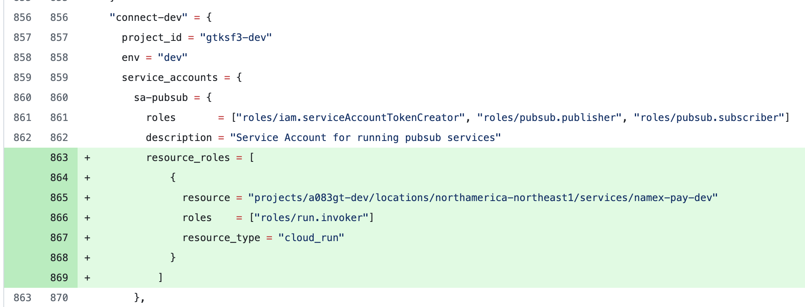

# Updating Terraform Configuration for Google Cloud's Custom Roles and Service Accounts

## Prerequisites
Before updating Terraform configuration, ensure you have the following:

- A working Terraform setup (`terraform` CLI installed)
- Access to the repository where the Terraform configuration is stored
- Appropriate permissions to push changes and apply Terraform updates
- Configured backend (if using remote state management)

## Steps to Update Terraform Configuration

1. Clone the Repository
2. Create a New Branch
3. Modify Terraform Configuration in `terraform.tfvars` file

- There are three variable files that can be modified:

`project_account_bindings.auto.tfvars`

  1) projects -  a map of GCP projects, where each project value consists of:

```
    project_id       = ...  # Unique ID for the project
    env              = ...  # Environment (e.g., dev, prod)

    service_accounts = ...  # Optional list of service accounts, where each account has
      roles                 # List of IAM roles assigned to the service account
      description           # Description of the service account

      external_roles        # Optional list of roles in other projects (i.e. not the current project), where each entry has
        roles               # List of roles granted on an external project
        project_id          # Project where the roles are granted

      resource_roles        # Optional list of resource specific roles, where each entry has
        resource            # Specific resource URI (e.g., bucket, topic) the role applies to
        roles               # List of roles assigned to the resource
        resource_type       # Type of resource (e.g., storage_bucket, pubsub_topic, artifact_registry, sa_iam_member)

    custom_roles     = ...  # Optional list of custom roles in the project
      title                 # Name of the custom IAM role
      permissions           # List of permissions assigned to the role
      description           # Description of the custom role

    pam_bindings     = ...  # Optional list of PAM (privileged access management) entitlements
        role                # Custom role name in the enetitlement
        principals          # List of principals that can be granted the role
        role_type           # Optional value, when set to 'custom' ensures custom role URI is properply generated


    instances        = ... # Optional list of cloudsql instances
        instance           # instance name
        databases          # list of databases
            db_name        # database name
            roles          # list of created custom roles to be managed by Terraform, e.g. ["readonly", "readwrite", "admin"]
            owner          # database owner/role creator
            database_role_assignment   # map of custom role assignments
                readonly               # list of ...@gov.bc.ca emails to be granted db custom roles
                readwrite              # list of ...@gov.bc.ca emails to be granted db custom roles
                admin                  # list of ...@gov.bc.ca emails to be granted db custom roles
```

For example, if you want to grant sa-pubsub service account in Connect Dev an invoker role for Cloud Run in Business Dev:


`environment_custom_roles.auto.tfvars`

  2) environments - a map of environments with their corresponding environment_custom_roles and pam_bindings

```
    environment_custom_roles   # List of custom roles shared across all projects in the environment
      title                    # Name of the custom IAM role
      permissions              # List of permissions assigned to the role
      description              # Description of the custom role

    pam_bindings              # Optional list of PAM (privileged access management) entitlements
        role                  # Custom role name in the enetitlement
        principals            # List of principals that can be granted the role
        role_type             # Optional value, when set to 'custom' ensures custom role URI is properply generated

  database_role_assignment   # Optional map of custom role assignments
                              (roles will apply to all databases in the corresponnding env, that are listed in `project_account_bindings.auto.tfvars`)
      readonly               # list of ...@gov.bc.ca emails to be granted db custom roles
      readwrite              # list of ...@gov.bc.ca emails to be granted db custom roles
      admin                  # list of ...@gov.bc.ca emails to be granted db custom roles
```

`global_custom_roles.auto.tfvars`

  3) global_custom_roles -  a map of global custom roles shared across all projects

```
    title                 # Name of the custom IAM role
    permissions           # List of permissions assigned to the role
    description           # Description of the custom role

    database_role_assignment   # Optional map of custom role assignments
                                (roles will apply to all databases, that are listed in `project_account_bindings.auto.tfvars`)
        readonly               # list of ...@gov.bc.ca emails to be granted db custom roles
        readwrite              # list of ...@gov.bc.ca emails to be granted db custom roles
        admin                  # list of ...@gov.bc.ca emails to be granted db custom roles
```

4. Merging the new branch into main will trigger 'terraform plan'
5. Output of terraform plan can be reviewed in https://app.terraform.io/app/BCRegistry/workspaces/gcp-iam/runs
6. If no errors are present, and if Terraform state changes are as expected, 'terraform apply' can be executed for the run in the UI (will either need permissions to access or ask SRE team to review)
